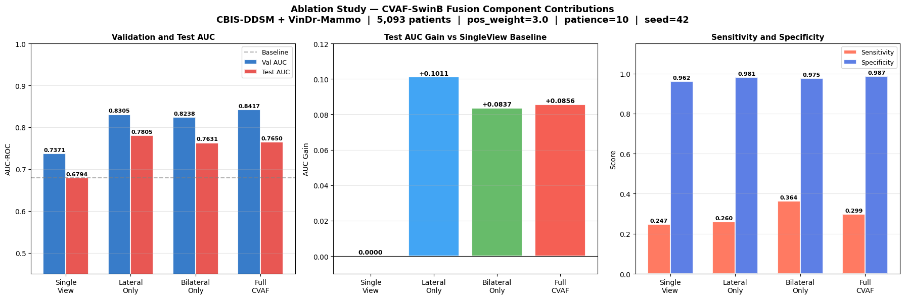

# CVAF-SwinB: Cross-View Asymmetric Fusion Swin Transformer for Breast Cancer Classification

[](https://www.python.org/)
[](https://pytorch.org/)
[](LICENSE)
[](https://kaggle.com)

> **Thesis:** Enhance Vision Transformer Based Breast Cancer Mammography Classification  
> **Author:** Nirjana Shrestha  
> **Institution:** Melbourne Institute of Technology (MIT)  
> **Year:** 2026

---
## Clinical Motivation

Breast cancer progresses through distinct tissue transformation stages.
Early detection via accurate mammography classification is critical for
improving patient outcomes.

<div align="center">
  
</div>

<div align="center">

  *Figure 1 — Progressive stages of breast tissue transformation from
normal epithelium to invasive ductal carcinoma*

</div>

---


## Overview

This repository contains the official implementation of **CVAF-SwinB**, a novel
multi-view Vision Transformer architecture for binary breast cancer classification
using four-view screening mammography (L-CC, L-MLO, R-CC, R-MLO).

<div align="center">
  
</div>

<div align="center">
  
*Figure 2 — Four view image*

</div>
CVAF-SwinB addresses the critical challenge of class imbalance in medical imaging
by combining a shared Swin-B backbone with two clinically-motivated fusion modules:
**Asymmetric Lateral Fusion** and **Bilateral Contralateral Fusion**.

---

## Model Architecture

<div align="center">
  
</div>

<div align="center">
  
*Figure 3 — Full CVAF-SwinB architecture showing the shared Swin-B backbone,
Asymmetric Lateral Fusion, Bilateral Contralateral Fusion, and
Gated Global Aggregation modules*

</div>

---

## Results

### Training Curve

<div align="center">
  
</div>

<div align="center">
  
*Figure 6 — CVAF-SwinB training and validation curve progression*
</div>div>

### Confusion Matrix
<div align="center">
  
</div>

<div align="center">
  
*Figure 7 — Confusion matrix of the proposed CVAF-SwinB model*
</div>

### Test Metrics Summary

<div align="center">
  
</div>

<div align="center">
  
*Figure 8 — Full test metrics of the proposed CVAF-SwinB model*
</div>


### Metrics vs Decision Threshold

<div align="center">
  
</div>

<div align="center">
  
*Figure 9 — Sensitivity, Specificity, F1, and Balanced Accuracy
across decision thresholds τ = 0.10 to 0.90*
</div>

---

## Class Balancing Strategy Comparison

### Strategy 2 — 1:1 Random Undersampling

<div align="center">
  
</div>

<div align="center">
  
*Figure 10 — Full evaluation metrics for Strategy 2*
</div>

<div align="center">
  
</div>

<div align="center">
  
*Figure 11 — Strategy 2 confusion matrix at default threshold τ = 0.50*
</div>

<div align="center">
  
</div>

<div align="center">

*Figure 12 — Strategy 2 confusion matrix at optimal threshold τ = 0.90*
</div>


### Strategy 3 — 3:1 Undersampling

<div align="center">
  
</div>

<div align="center">


*Figure 13 — Training curve for Strategy 3 (3:1 undersampling)*
</div>

<div align="center">
  
</div>

<div align="center">

*Figure 14 — Full evaluation results for Strategy 3*
</div>

### Strategy 4 — 3:1 Oversampling

<div align="center">
  
</div>

<div align="center">

*Figure 15 — Training curve for Strategy 4 (3:1 oversampling)*
</div>

<div align="center">
  
</div>

<div align="center">

*Figure 16 — Full evaluation results for Strategy 4*
</div>

### Ablation Study — Contribution of Each Fusion Component

<div align="center">
  
</div>
<div align='center'>
  
*Figure 2 — Ablation study results comparing SingleView, LateralOnly,
BilateralOnly, and Full CVAF-SwinB configurations*
</div>

<div align='center'>
  
| Configuration        | Test AUC | Val AUC | Gain vs. Baseline |
|----------------------|----------|---------|-------------------|
| SingleView (Baseline)| 0.6794   | 0.7371  | —                 |
| LateralOnly          | 0.7805   | 0.8305  | +0.1011           |
| BilateralOnly        | 0.7631   | 0.8238  | +0.0837           |
| **Full CVAF-SwinB**  | **0.7518**| **0.8417** | **+0.0724**  |

</div>


### Comparison with State-of-the-Art

  
| Model                | Dataset   | AUC        |
|----------------------|-----------|------------|
| MV-Swin-T (Baseline) | CBIS-DDSM | 0.7138     |
| **CVAF-SwinB (Ours)**| CBIS-DDSM | **0.7518** |

---

## Dataset

| Dataset     | Source                                                    | Licence               |
|-------------|-----------------------------------------------------------|-----------------------|
| CBIS-DDSM   | [TCIA](https://www.cancerimagingarchive.net/)             | CC BY 3.0             |
| VinDr-Mammo | [PhysioNet](https://physionet.org/)                      | Credentialed Access   |

- Combined dataset: **5,093 patients**, **4,581 benign**, **512 malignant**
- Natural class imbalance ratio: **~9:1**
- Four views required per patient: L-CC, L-MLO, R-CC, R-MLO

---


## Reproducibility

| Setting               | Value                        |
|-----------------------|------------------------------|
| Random Seed           | 42 (fixed across all runs)   |
| Deterministic Mode    | Enabled                      |
| Mixed Precision       | torch.cuda.amp               |
| Best Model Selection  | Highest validation AUC epoch |
| Platform              | Kaggle (GPU P100 / T4)       |

---

## Ethics and Data Usage

- All datasets are publicly available anonymised research benchmarks
- No personally identifiable information (PII) was accessed or stored
- CBIS-DDSM: licensed under CC BY 3.0 via TCIA
- VinDr-Mammo: licensed under PhysioNet Credentialed Access
- This research complies with GDPR and institutional data governance policies

---

## Citation

```bibtex
@thesis{shrestha2026cvaf,
  title  = {Enhance Vision Transformer Based Breast Cancer
            Mammography Classification},
  author = {Nirjana Shrestha},
  year   = {2026},
  school = {Melbourne Institute of Technology},
  type   = {Master's Thesis}
}
```

---

## License

This project is licensed under the MIT License.
See the [LICENSE](LICENSE) file for details.
